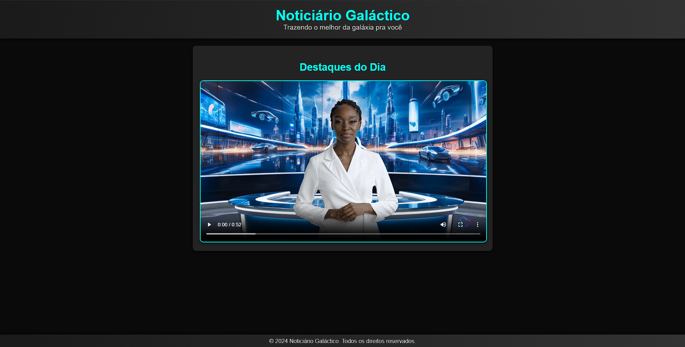

# Noticiário Galáctico
## 📒 Descrição
Este projeto é um noticiário futurista, apresentado por um avatar, utiliza inteligência artificial para gerar notícias fictícias sobre eventos no universo.
## 🤖 Tecnologias Utilizadas
- **`ChatGPT (OpenAI):`** Para gerar o roteiro do noticiário, utilizando prompts específicos para criar notícias fictícias com informações relevantes e interessantes.
- **`Leonardo.ai:`** Para gerar a imagem de fundo do estúdio futurista, utilizando modelos de inteligência artificial para criar um ambiente visualmente impressionante e realista.
- **`HeyGen:`** Para criar o vídeo final com o avatar, utilizando a imagem de fundo gerada e o roteiro do ChatGPT. O HeyGen permite a sincronização de lábios, animação facial e a geração de voz, criando uma experiência imersiva para o espectador.
## 🧐 Processo de Criação
1. Geração do Roteiro: Utilizando o [ChatGPT (OpenAI)](https://openai.com/chatgpt/) para gerar notícias fictícias. 
2. Criação do Cenário: Utilizando o [Leonardo.ai](https://leonardo.ai/) para gerar a imagem de fundo do estúdio futurista.
3. Produção do Vídeo: Utilizando o [HeyGen](https://app.heygen.com/), montamos o vídeo final com o avatar, a imagem de fundo gerada e o roteiro do ChatGPT. Personalizamos o avatar com aparência e voz realistas. 
## 🚀 Resultados
O resultado final é um noticiário futurista cativante e envolvente. O avatar realista, o cenário futurista e as notícias fictícias. 

    

Para acessar o deploy do Noticiário Galáctico, siga este link: https://dio-natty-or-not.vercel.app/

## 💭 Reflexão
Este projeto demonstra o potencial da inteligência artificial para a criação de conteúdo criativo e envolvente. A combinação de diferentes ferramentas de IA, como ChatGPT, Leonardo.ai e HeyGen, permite a produção de vídeos de alta qualidade, com um nível de realismo impressionante. No futuro, a inteligência artificial poderá revolucionar a forma como consumimos conteúdo, criando novas formas de entretenimento e informação.
